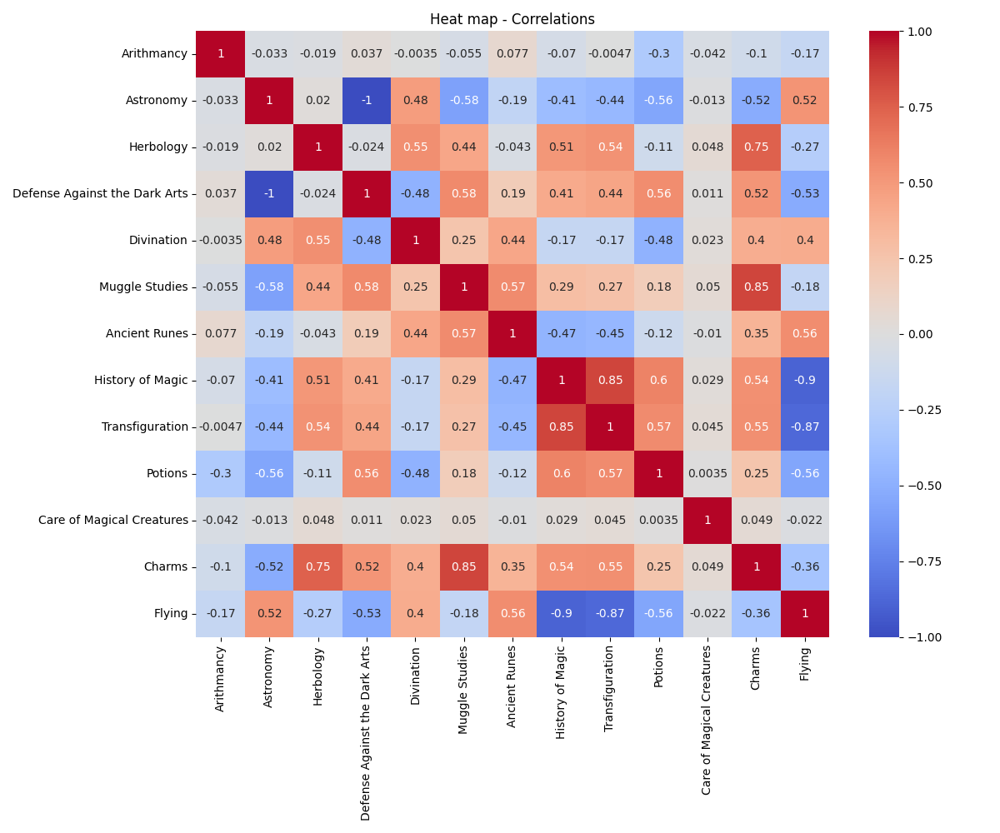
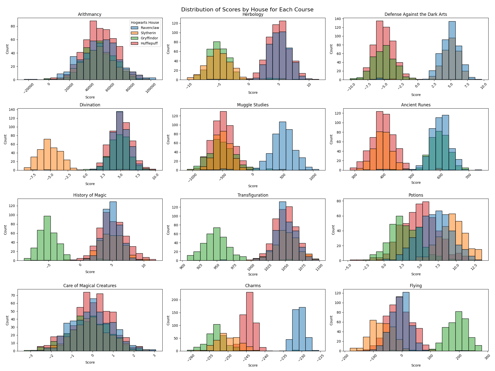
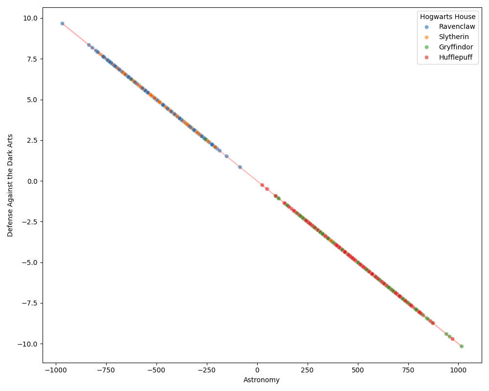
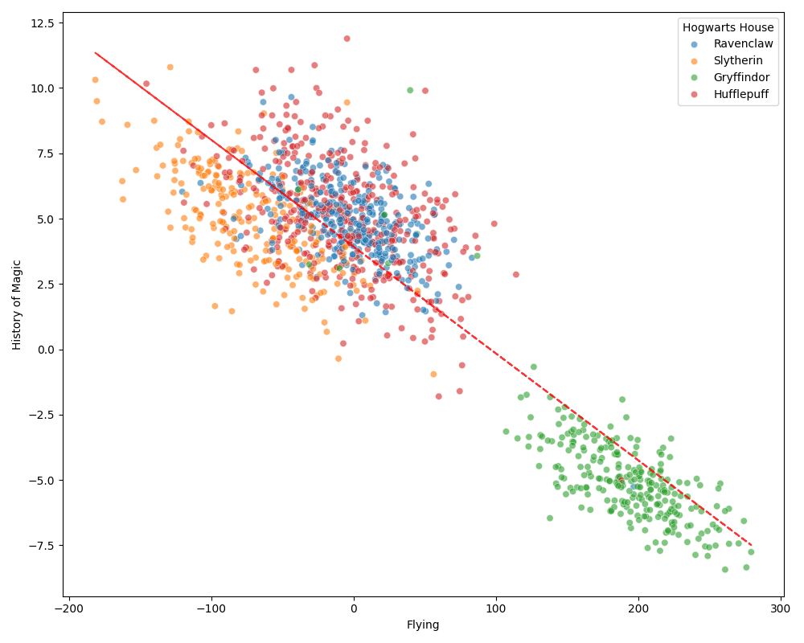

# dslr

## Install

> Create python virtual enviroment and download dependencies

```bash
python -m venv .venv
source .venv/bin/activate
pip install -r requirements.txt
```

Run the jupyter enviroment

```bash
jupyter lab
```

## Data exploration

### Heatmap



### Histogram



### Scatter plot

Strongest correlation between courses



Second strongest correlation between courses



### Pair plot


